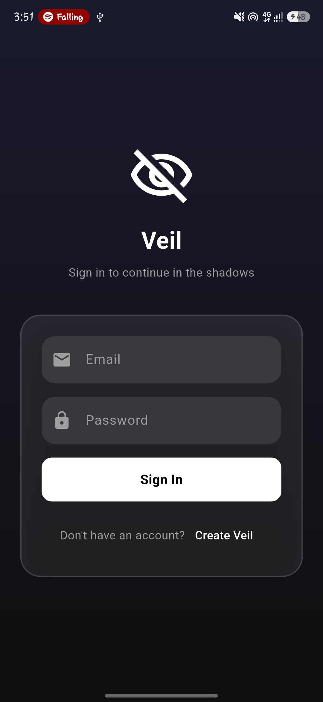
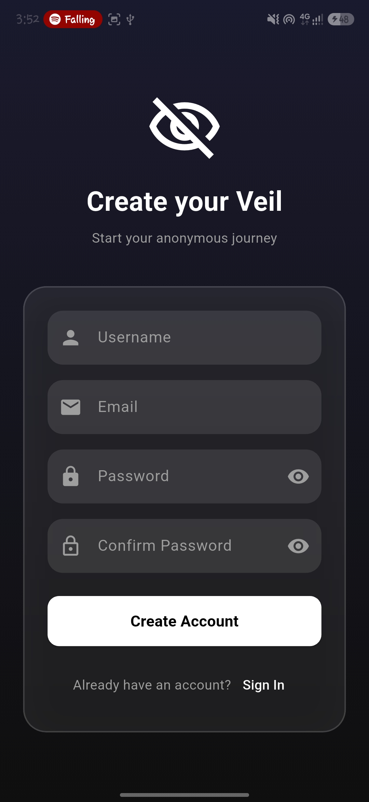
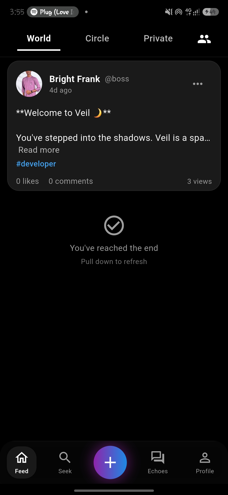
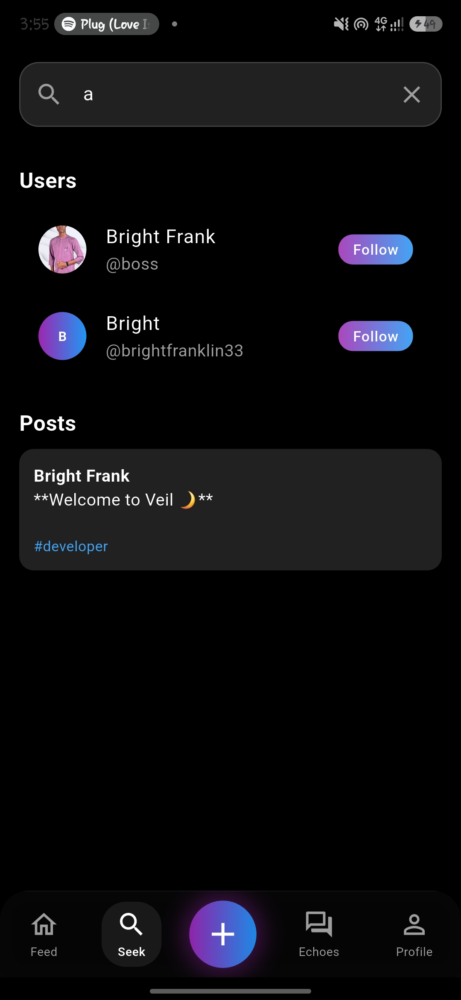
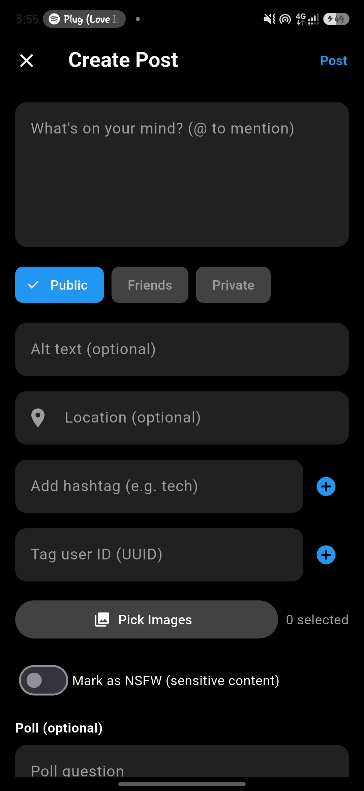
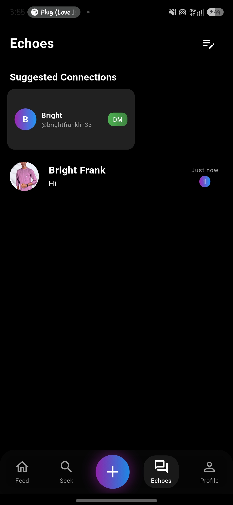
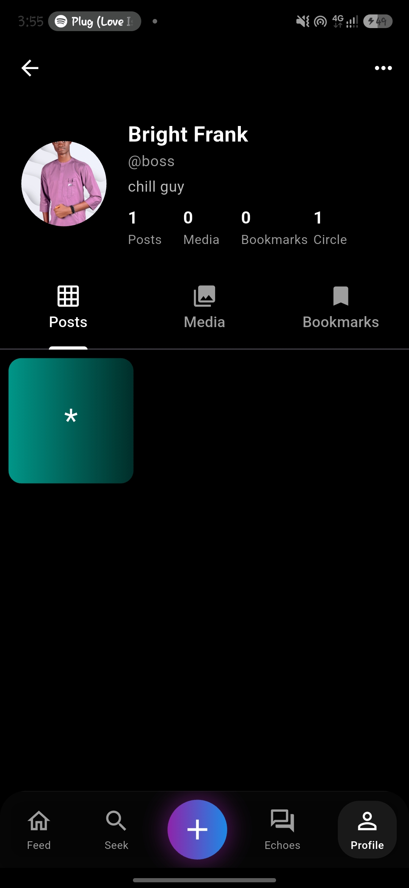

<h1 align="center">🕶️ Veil</h1>
<p align="center">
  <strong>Anonymous Social App – Built with Flutter & Supabase</strong>
</p>

<p align="center">
  <a href="#-features">Features</a> •
  <a href="#-tech-stack">Tech Stack</a> •
  <a href="#-getting-started">Getting Started</a> •
  <a href="#-environment-variables">Environment Variables</a> •
  <a href="#-contributing">Contributing</a> •
</p>

<p align="center">
  
  
  
  
</p>

---

## 📖 Overview

**Veil** is a privacy‑first social platform where users can share content anonymously without creating a persistent public identity. Built with Flutter for a smooth cross‑platform experience and Supabase for real‑time backend services.

---

## ✨ Features

### 🔐 Authentication
- Email/Password sign‑up with **OTP verification**
- Secure session management with automatic token refresh

### 👤 User Experience
- **Glass‑morphism UI** with dark theme for visual comfort
- **Username** is the primary identifier (not email)
- Email verification required before account activation
- Seamless navigation with Riverpod state management

### 📡 Real‑time
- Powered by Supabase Realtime subscriptions
- Live updates for posts, comments, and notifications

### 🛡️ Privacy
- Usernames are unique but not tied to personal information
- No public email display
- Users control what they share

---

## 🛠️ Tech Stack

| Technology | Purpose |
|------------|---------|
| **Flutter** | Cross‑platform UI framework |
| **Dart** | Programming language |
| **Supabase** | Backend (Auth, Database, Storage, Realtime) |
| **Riverpod** | State management |
| **GoRouter** | Navigation & routing |

---

## 📱 Screenshots

## 📱 Screenshots

<div align="center">
  <table>
    <tr>
      <td align="center">
        
        <br />
        <sub><b>Login Screen</b></sub>
      </td>
      <td align="center">
        
        <br />
        <sub><b>Sign Up Screen</b></sub>
      </td>
      <td align="center">
        
        <br />
        <sub><b>Main Feed</b></sub>
      </td>
    </tr>
    <tr>
      <td align="center">
        
        <br />
        <sub><b>Explore Screen</b></sub>
      </td>
      <td align="center">
        
        <br />
        <sub><b>Create Post Screen</b></sub>
      </td>
      <td align="center">
        
        <br />
        <sub><b>Echoes Screen</b></sub>
      </td>
    </tr>
    <tr>
      <td align="center">
        
        <br />
        <sub><b>Profile Screen</b></sub>
      </td>
    </tr>
  </table>
</div>

---

## 🎥 Key Flows

| Login to App | Sign Up with OTP | Email Verification |
|--------------|------------------|---------------------|
|  |  |  |

---

## 🚀 Getting Started

### Prerequisites

- Flutter SDK **3.27.0** or higher
- Dart SDK **3.6.0** or higher
- A Supabase project (free tier works)

### Installation

```bash
# Clone the repository
git clone https://github.com/BrightFK/veil.git

# Navigate to project directory
cd veil

# Install dependencies
flutter pub get

# Create environment file
cp .env.example .env

# Fill in your Supabase credentials (see below)

# Run the app
flutter run
```

### Running on Specific Platforms

```bash
flutter run -d chrome       # Web
flutter run -d android      # Android
flutter run -d ios          # iOS (macOS only)
```

---

## 🔐 Environment Variables

Create a `.env` file in the project root with the following variables:

```env
# Supabase Configuration
SUPABASE_URL=https://your-project.supabase.co
SUPABASE_ANON_KEY=your_anon_key_here
```

> **⚠️ Important:** Never commit the `.env` file to version control. It's already ignored via `.gitignore`.


## 🤝 Contributing

We welcome contributions! Please follow these steps:

1. Fork the repository.
2. Create your feature branch (`git checkout -b feature/amazing-feature`).
3. Commit your changes (`git commit -m 'feat: add amazing feature'`).
4. Push to the branch (`git push origin feature/amazing-feature`).
5. Open a Pull Request.

### Commit Convention

We follow [Conventional Commits](https://www.conventionalcommits.org/):

- `feat:` New feature
- `fix:` Bug fix
- `docs:` Documentation only
- `style:` Code style (formatting, etc.)
- `refactor:` Code refactoring
- `perf:` Performance improvement
- `test:` Adding tests
- `chore:` Build process or tooling


## 🙏 Acknowledgements

- [Supabase](https://supabase.com) – Open‑source Firebase alternative
- [Flutter](https://flutter.dev) – Beautiful UI toolkit
- [Riverpod](https://riverpod.dev) – Reactive state management
- All contributors and open‑source libraries that made this possible

---

## 📬 Contact

**Bright Franklin** – [GitHub](https://github.com/BrightFK)

---

<p align="center">
  Made with ❤️ and ☕️
</p>

